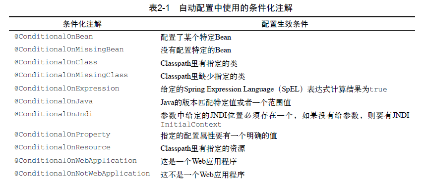

# 1.初始化

## 1.1启动引导类和配置类

```java
//开启组件扫描和自动配置
@SpringBootApplication
public class Demo01Application {

    public static void main(String[] args) {
        //负责启动引导应用程序
        SpringApplication.run(Demo01Application.class, args);
    }

}
```


@SpringBootApplication:将三个有用的注解结合在了一起

- Spring的@ComponentScan：启用组件扫描，能够自动发现并注册编写的其他组件
- Spring的@Configuration：标明该类使用Spring基于Java的配置
- SpringBoot的@EnableAutoConfiguration:也可以被称为@Abracadabra，开启SpringBoot的自动配置功能


```xml
<build>
    <plugins>
        <plugin>
            <groupId>org.springframework.boot</groupId>
            <artifactId>spring-boot-maven-plugin</artifactId>
        </plugin>
    </plugins>
</build>
```

​		SpringBoot的构建插件，提供了一个spring-boot:run目标，能以将项目打包成一个jar文件


## 1.2起步依赖

​		Spring Boot提供众多起步依赖降低项目依赖的复杂度，本质上是一个maven项目对象模型，定义了对其他库的传递依赖，这些东西加在一起支持某项功能

​		起步依赖不需要指定版本号，起步依赖的版本由正在使用的Spring Boot版本决定，起步依赖会决定他们引入的传递依赖的版本。maven会基于使用最近依赖原则覆盖依赖，需要覆盖传递依赖在pom文件中添加依赖和版本就行


## 1.3自动配置

​		**条件化配置：**条件化配置允许配置存在于应用程序中，但在满足某些特定条件之前都忽略这个配置




## 1.4自定义配置

​		可以通过Java类显示覆盖自动配置


​		Spring Boot应用程序有多种设置途径，Spring Boot能从多种属性源获得属性，优先级从高到低分别为：

1. 命令行参数如：java -jar readinglist-0.0.1-SNAPSHOT.jar --spring.main.show-banner=false
2. java:comp/env里的JNDI属性
3. JVM系统属性
4. 操作系统环境变量
5. 随机生成的带random.*前缀的属性（设置其他属性时可以引用它们，如${random.long}）
6. 应用程序以外的application.properties或者application.yml
7. 打包在应用程序内的application.properties或者application.yml
8. 通过@PropertySource标注的属性源
9. 默认属性


​		application.properties和application.yml能放在以下四个目录，按优先级高到低排列

1. 外置，在相对于应用程序运行目录的/config子目录
2. 外置，在应用程序运行的目录里
3. 内置，在config包内
4. 内置，在classpath根目录


​	  同一优先级位置同时有application.properties和application.yml，那么application.yml里的属性会覆盖application.properties里的属性